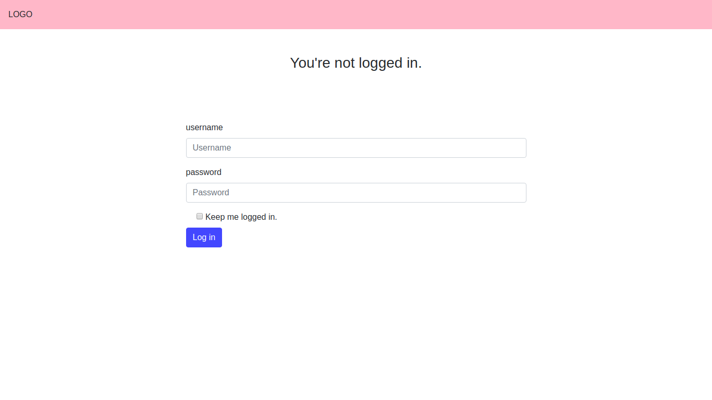
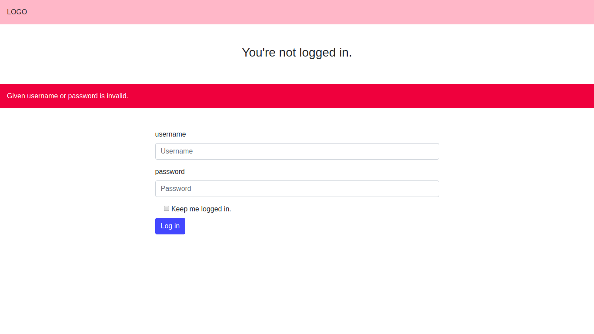
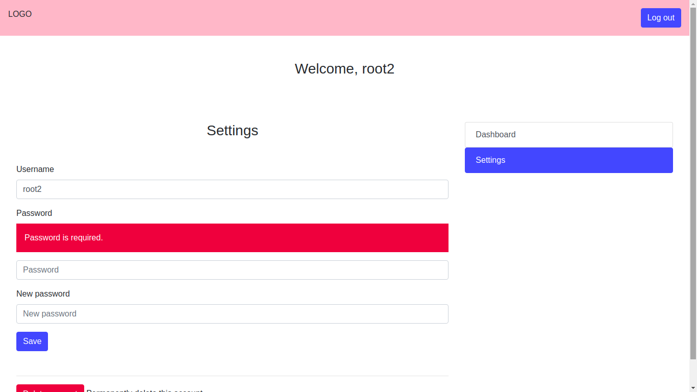

# Just a simple PHP user authentication and registration
(without database) I just want to test my knowledge about session.

Does not include 'forget password' and 'remember me'.

Username and password is stored in users.json file.

